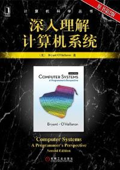

### Reading
During my senior middle school time, I have little time to go out and it seems that life is filled with finishing exercises after classes
and preparing for exams. At that time, I tried to develop the habit of reading when I am frustrated by endless exercises and exams. 
After entering college, I began to use Douban, where everyone can share their opinions of books and films and even games with each other. Here is [My Douban](https://www.douban.com/people/175875998/).
I want to share some books that I like most.

                
                
                
                
                
                

### Game
I like games. Some are my partners to accompany me when I am lonely during my childhood. Some can broaden my scope by experiencing a different life.
Some teach me lots of historical and geographic knowledge, and even driving me to learn a foreign language.
They deserve the praise as "the ninth category of art".
I want to share some games that have great impact on my life.

- [Tomb Raider](https://store.steampowered.com/app/203160/Tomb_Raider/)
- [Assassin's Creed II](https://www.ubisoft.com/en-us/game/assassins-creed/assassins-creed-ii)
- [The Last of US](https://www.playstation.com/en-us/games/the-last-of-us-part-i/)
- [Command & Conquer: Red Alert 2](https://game.chronodivide.com/)
- [Super Mario Odyssey](https://www.nintendo.com/store/products/super-mario-odyssey-switch/)
- [信長の野望・創造](http://www.gamecity.ne.jp/souzou/)
- [三國志１１](https://www.gamecity.ne.jp/sangokushi/11wpk/)
- [梦幻西游](https://xyq.163.com/)

Also, my PlayStation Network id is "ikusyou", looking forward to more game friends :-)

[Go to the Home Page](https://huyuzhang.github.io)