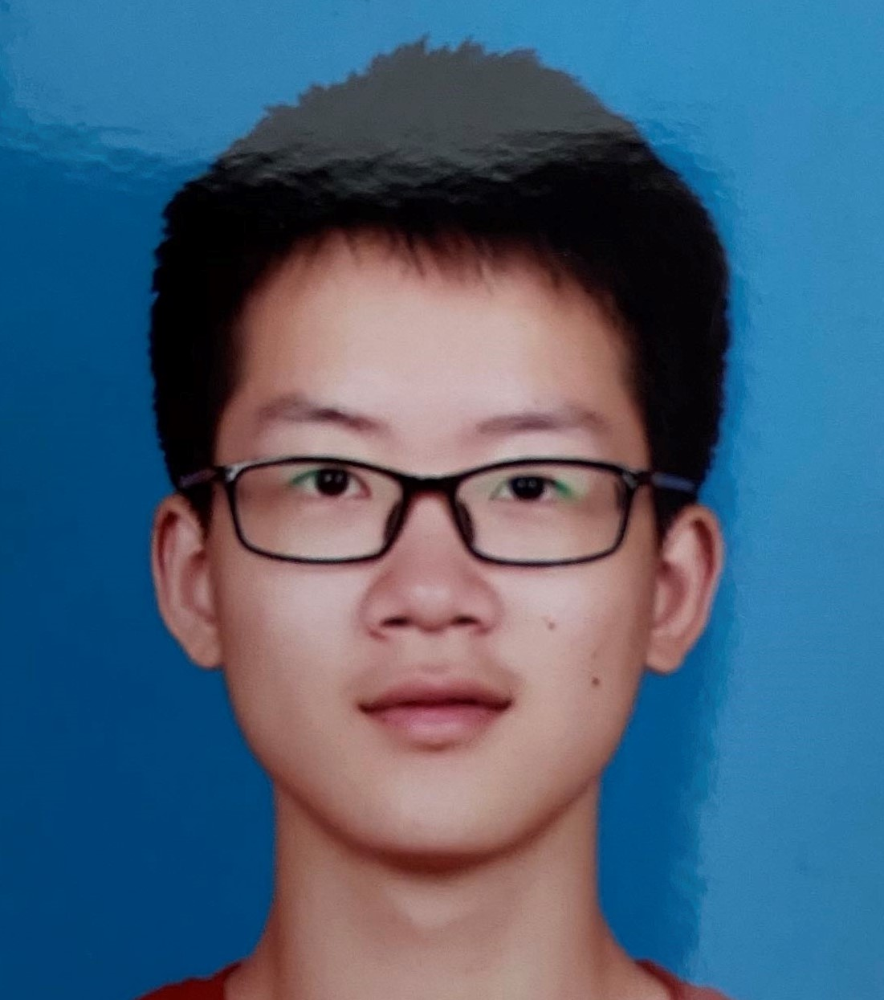

## Yuzhang Hu


<!--  -->

Hi, I'm Hu Yuzhang. I am currently pursuing the Master degree in Peking University, advised by Prof. Jiaying Liu.
My research interests include video compression and image enhancement.
I am also interested in football, cycling, train, mystery novels, geography and history of ancient East Asia.
You can contact me by mail: yuzhanghu@pku.edu.cn

<!-- ### Markdown

Markdown is a lightweight and easy-to-use syntax for styling your writing. It includes conventions for

```markdown
Syntax highlighted code block

# Header 1
## Header 2
### Header 3

- Bulleted
- List

1. Numbered
2. List

**Bold** and _Italic_ and `Code` text

[Link](url) and 
``` -->

For more details see [Basic writing and formatting syntax](https://docs.github.com/en/github/writing-on-github/getting-started-with-writing-and-formatting-on-github/basic-writing-and-formatting-syntax).

### Experience

- Bachelor in Computer Science, School of Electronics Engineering and Computer Science (EECS).
- Master student in Computer Science, Acedemy for Advanced Interdisciplinary Studies (AAIS).

### Publication

- Yuzhang Hu, Sifeng Xia, Wenhan Yang, Jiaying Liu. "Memory-Augmented Auto-Regressive Network for Frame Recurrent Inter Prediction", IEEE International Symposium on Circuits and Systems (ISCAS), Seville, Spain, May 2020.
- Yuzhang Hu, Sifeng Xia, Wenhan Yang, Jiaying Liu. "Sensitivity-Aware Bit Allocation for Intermediate Deep Feature Compression", IEEE International Conference on Visual Communications and Image Processing (VCIP), Macau, China, December 2020.

### Skill
- C++
- Python
- PyTorch
- 日本語 (JLPT N2)


