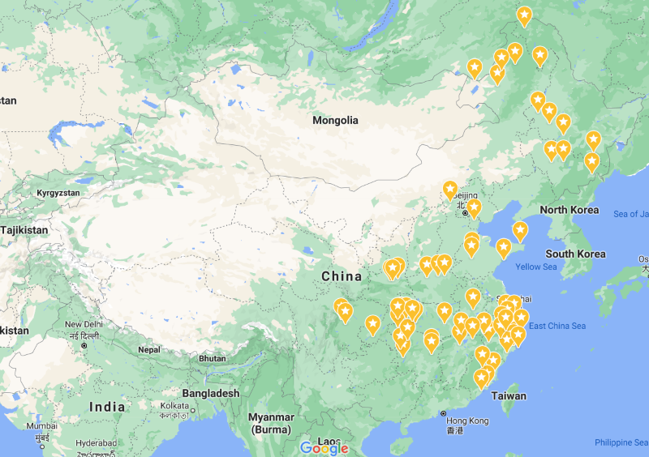
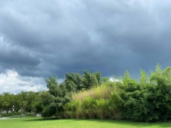
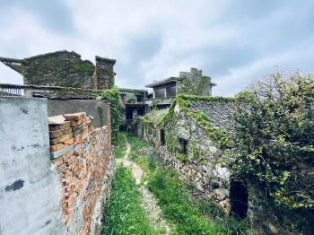
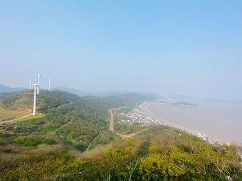
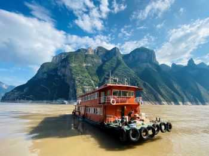
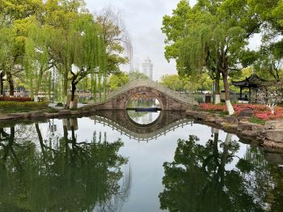
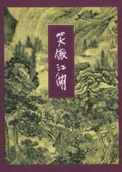

## Yuzhang Hu


<!--  -->

Hi, I'm Hu Yuzhang. I am currently pursuing the Master degree in Peking University, advised by Prof. Jiaying Liu.
My research interests include video compression and image enhancement.
I am also interested in football, cycling, train, mystery novels, geography and history of ancient East Asia.
You can contact me by mail: yuzhanghu@pku.edu.cn

<!-- ### Markdown

Markdown is a lightweight and easy-to-use syntax for styling your writing. It includes conventions for

```markdown
Syntax highlighted code block

# Header 1
## Header 2
### Header 3

- Bulleted
- List

1. Numbered
2. List

**Bold** and _Italic_ and `Code` text

[Link](url) and 
``` -->

For more details see [Basic writing and formatting syntax](https://docs.github.com/en/github/writing-on-github/getting-started-with-writing-and-formatting-on-github/basic-writing-and-formatting-syntax).

### Experience

- Bachelor in Computer Science, School of Electronics Engineering and Computer Science (EECS).
- Master student in Computer Science, Acedemy for Advanced Interdisciplinary Studies (AAIS).

### Publication

- Yuzhang Hu, Sifeng Xia, Wenhan Yang, Jiaying Liu. "Memory-Augmented Auto-Regressive Network for Frame Recurrent Inter Prediction", IEEE International Symposium on Circuits and Systems (ISCAS), Seville, Spain, May 2020.
- Yuzhang Hu, Sifeng Xia, Wenhan Yang, Jiaying Liu. "Sensitivity-Aware Bit Allocation for Intermediate Deep Feature Compression", IEEE International Conference on Visual Communications and Image Processing (VCIP), Macau, China, December 2020.

### Skill
- C++
- Python
- PyTorch
- 日本語 (JLPT N2)

------------------------------------
So that's all about my research. What I want to show next is how I enjoy the world.

### About Travel


Each time when I go to a new place, I will mark it in the Google Map (updating...). These are the cities where I have left my footprints up to now.
Many of these memories still impress me even today. I have set myself a few goals driven by my ambition to explore the world.

1. Travel all the provinces in China before 2028.
2. Travel to 10 countries in Aisa before 2038.
3. Travel to all continents except Antarctica before 2048.

### About Photograph
During my journey, I will always take many photos, and the  pleasant flavour of these experience can be recollected with them.
I do not have advanced equipments like SLR camera so I just use my mobile phone. I'm glad to share the stories behind these phostos If you like some of them.









### About Reading
During my senior middle school time, I have little to go out and it seems that life is filled with finishing exercises after classes
and preparing for exams. At that time, I tried to develop the habit of reading when I am frustrated by endless exercises and exams. 
After entering college, I begain to use Douban, where everyone can share their opinions of books and films and even games with each other. [My Douban](https://www.douban.com/people/175875998/)
I want to share some books that I like most.




