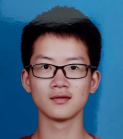

<!--  -->

<div  align="center">    
 
</div>
<!--  -->

Hi, I'm Hu Yuzhang. I am currently pursuing a Master degree at Peking University, advised by Prof. Jiaying Liu.
My research interests include video compression and image enhancement.
I am also interested in football, cycling, badminton, hiking, mystery novels, geography, and the history of ancient East Asia.
You can contact me by mail: yuzhanghu@pku.edu.cn

<!-- ### Markdown

Markdown is a lightweight and easy-to-use syntax for styling your writing. It includes conventions for

```markdown
Syntax highlighted code block

# Header 1
## Header 2
### Header 3

- Bulleted
- List

1. Numbered
2. List

**Bold** and _Italic_ and `Code` text

[Link](url) and 
​``` -->


### Education

- Bachelor in Computer Science, EECS, Peking University.
- Master student in Computer Science, AAIS, Peking University.


### Publication
- **Yuzhang Hu**, Wenhan Yang, Jiaying Liu, Zongming Guo. "Deep Inter Prediction with Error-Corrected Auto-Regressive Network for Video Coding", *ACM Transactions on Multimedia Computing Communications and Applications* (*TOMM*), March 2022. [[pdf]](https://doi.acm.org/?doi=3528173)
- **Yuzhang Hu**, Wenhan Yang, Jiaying Liu, Zongming Guo. "Rain-Prior Injected Knowledge Distillation for Single Image Deraining", *IEEE International Conference on Image Processing* (*ICIP*), Bordeaux, France, Oct. 2022. [[pdf]](http://39.96.165.147/Pub%20Files/2022/hyz_icip22.pdf)
- **Yuzhang Hu**, Sifeng Xia, Wenhan Yang, Jiaying Liu. "Memory-Augmented Auto-Regressive Network for Frame Recurrent Inter Prediction", *IEEE International Symposium on Circuits and Systems* (*ISCAS*), Seville, Spain, May 2020. [[pdf]](http://39.96.165.147/Pub%20Files/2020/hyz_iscas20.pdf)
- **Yuzhang Hu**, Sifeng Xia, Wenhan Yang, Jiaying Liu. "Sensitivity-Aware Bit Allocation for Intermediate Deep Feature Compression", *IEEE International Conference on Visual Communications and Image Processing* (*VCIP*), Macau, China, Dec. 2020. [[pdf]](http://39.96.165.147/Pub%20Files/2020/hyz_vcip20.pdf)
- **Yuzhang Hu**, Wenhan Yang, Jiaying Liu, Zongming Guo. "Collaborative Spatial-Temporal Distillation for Efficient Video Deraining", *Accepted by IEEE International Conference on Image Processing* (*ICME*), Brisbane, Australia, July 2023.
- Minghao Liu, Wenhan Yang, **Yuzhang Hu**, and Jiaying Liu. “Dual Prompt Learning for Continual Rain Removal from Single Images”, *Accepted by International Joint Conference on Artificial Intelligence* (*IJCAI*), Macao, China, Aug. 2023.
- Minghao Liu, Jiaxuan Xie, **Yuzhang Hu**, Wenhan Yang, and Jiaying Liu. “Dual Prompt Learning for Continual Rain Removal from Single Images”, *Under Submission*.


### Experience
- Deployment and Acceleration of Real-Time Super-Reolution Neural-Network on Edge Devices, Internship in Amazon Lab126, Beijing, from 2022.6 to 2022.10.
- Algorithm Engineer of Video Coding and Processing, Full-time Job in Alibaba Cloud, Hangzhou, will start from 2023.7.


### Skill
- C++, Python
- PyTorch, TensorFlow
- HEVC, VVC
- Chinese (Mandarin and Shanghainese), English (CET-6), Japanese (JLPT N2)

------------------------------------
So that's all about my research. What I want to show next is how I enjoy the world.

[About My Travel](https://huyuzhang.github.io/travel)

[About My Hobby](https://huyuzhang.github.io/hobby)