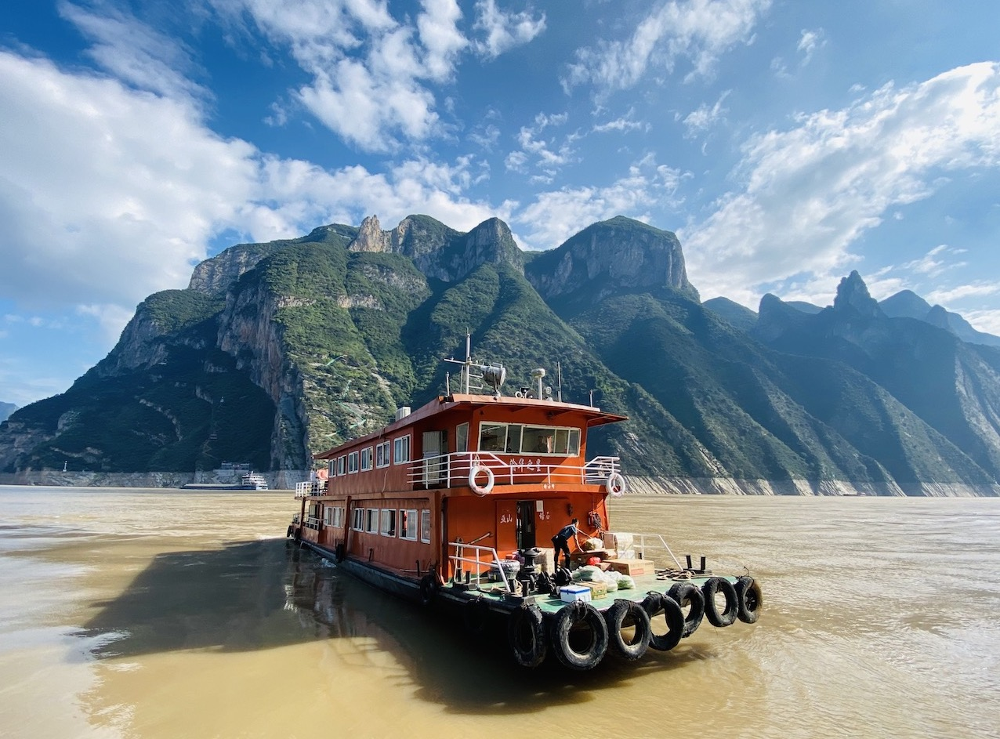

### Footprint

Each time I go to a new place, I will mark it in the Google Map (updating...). These are the cities where I have left my footprints up to now.
Many of these memories still impress me even today. I have set myself a few goals driven by my ambition to explore the world.

1. Travel all the provinces in China before 2028.
2. Travel to 10 countries in Aisa before 2038.
3. Travel to all continents except Antarctica before 2048.

### Photograph
During my journey, I will always take many photos, and the pleasant flavor of these experiences can be recollected with them.
I do not have advanced equipment like SLR camera so I just use my mobile phone. I'm glad to share the stories behind these photos If you like some of them.

<!-- ***News!*** I'm honored to become the chief assistant of [Jasmin3q](https://github.com/Jasmin3q). Please wait to see more photography works under her guidance! -->

                
                
                
                
                
                
                
                
                

### My Bike

[Go to the Home Page](https://huyuzhang.github.io)
